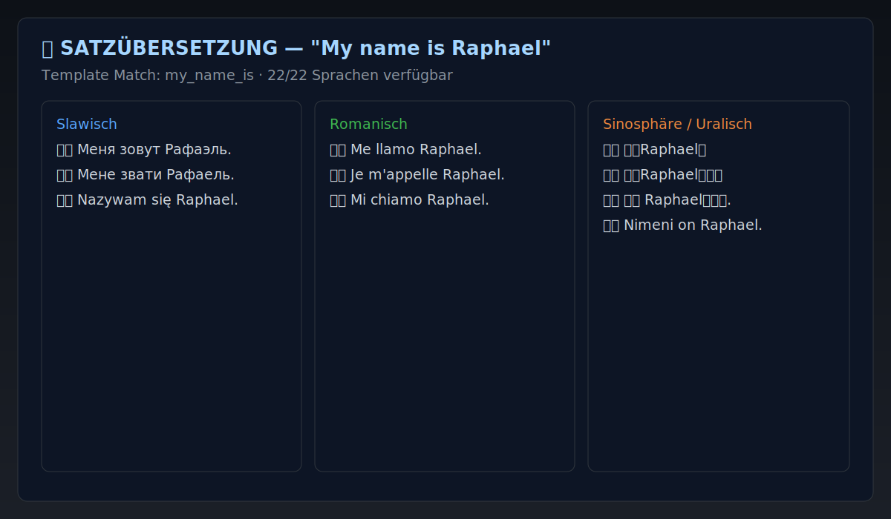

# Polyglot CLI

**Polyglot CLI** is an offline-first, research-oriented language learning system for comparative multilingual acquisition.  
It combines spaced repetition, cross-language transfer, sentence template practice, conjugation drills, and progress analytics in a terminal-native interface.

---

## Abstract

Polyglot CLI explores a practical hypothesis: **if lexical concepts are taught in clustered language families, retention and transfer improve versus isolated single-language study**. The project operationalizes this hypothesis by combining:

- concept-linked vocabulary across 22 languages,
- SRS scheduling for temporal memory reinforcement,
- sentence templates for controlled production practice,
- and local deterministic validation for reproducible content quality.

The result is a fast, private, and extensible environment suitable for independent learners and experimentation-heavy workflows.

---

## Core Contributions

1. **Cross-lingual concept graph learning** (Slavic, Romance, Sinosphere, and more).
2. **Offline-first deterministic architecture** (no API dependency required for core usage).
3. **Versioned, incremental corpus loading** with duplicate-safe imports.
4. **Multiple interaction modes**: quiz, cloze, sentence translation, speed drills, review, custom vocab.
5. **Validation and generation toolchain** for scalable content expansion.

---

## Visual Overview

### 1) Main dashboard and progression surface


### 2) Sentence translation with template matching



### 3) Cross-family cluster comparison


> Note: these screenshots are terminal-style visual captures intended to document UX structure and learning flow.

---

## Feature Set

- **22 supported languages** with shared concept coverage.
- **SRS review engine** for long-term memory consolidation.
- **Cluster drills** to exploit cognates and family-level similarity.
- **Sentence templates** for immediate productive usage.
- **CEFR-aware drill selection** for adaptive phrase difficulty targeting.
- **Conjugation practice** with morphology-oriented repetition.
- **Adaptive + gamified systems** (daily challenge, XP, statistics).
- **Custom vocabulary ingestion** for personal or domain-specific lexicons.

---

## Corpus Scope (Current)

As of `DATA_VERSION = 2026.11`:

- **22 languages**
- **242 word data files** (base + expansion packs)
- Per-language word totals currently in the high hundreds (roughly **372–376 raw entries**, language-dependent)

This growth is supported by automated phrase-pack generation plus strict offline validation.

---

## System Architecture

- [polyglot.py](polyglot.py): CLI entrypoint and high-level orchestration.
- [app.py](app.py): dependency wiring and application context lifecycle.
- [db/database.py](db/database.py): SQLite persistence, transactions, and commit control.
- [utils/data_loader.py](utils/data_loader.py): version-aware incremental imports.
- [engines](engines): feature engines (`srs`, `quiz`, `sentence`, `conjugation`, `adaptive`, etc.).
- [commands](commands): user command surfaces.
- [ui](ui): Rich-powered terminal rendering.

### Data Flow

1. Startup initializes database and app context.
2. Data loader checks stored `data_version`.
3. If bundle version changed, missing content is imported incrementally.
4. Learning sessions update review state, stats, and progress artifacts.

---

## Reproducibility and Quality Assurance

Polyglot CLI favors local reproducibility over opaque online dependency.

### Offline quality gate

```bash
python scripts/validate_content.py
python scripts/content_quality_report.py
```

Validation includes:

- JSON schema and structural consistency checks
- duplicate tuple detection
- pack consistency checks
- sentence template coverage and integrity checks
- language-level quality scoring (`raw_count`, uniqueness, category coverage, CEFR tag coverage)

### Static and behavioral checks

```bash
ruff check .
mypy .
pytest -q
```

CI is configured to run lint, type-checking, and tests on pushes/PRs.

---

## Installation and Usage

### Requirements

- Python 3.11+

### Quick start

```bash
pip install -e .
polyglot
```

### Development setup

```bash
pip install -e .[dev]
ruff check .
mypy .
pytest -q
python scripts/validate_content.py
python scripts/content_quality_report.py
```

---

## Learning Methodology (Practical Research Framing)

Polyglot CLI implements a layered acquisition strategy:

1. **Lexical foundation** through high-frequency concept entries.
2. **Family transfer** via cluster comparison (form/meaning alignment).
3. **Temporal reinforcement** using SRS intervals.
4. **Contextual production** with sentence templates and cloze tasks.
5. **Morphosyntactic reinforcement** through conjugation and pattern drills.

This approach seeks to maximize retention-per-minute for multilingual learners.

---

## Extending Content

- Add or modify files under [data/words](data/words).
- Add sentence templates in [data/sentences/templates.json](data/sentences/templates.json).
- Use generation scripts in [scripts](scripts) for scale operations.
- For phrase packs, include CEFR metadata in `notes` using `cefr:<level>`.
- Run validator before committing new packs.
- Bump `DATA_VERSION` in [config.py](config.py) so incremental import runs on startup.

---

## Known Limitations / Next Directions

- No built-in audio corpus for all entries yet.
- Formal benchmark studies (A/B against monolingual sequence learning) are future work.
- Optional online verification pipeline could complement local deterministic validation.

---

## License

MIT
